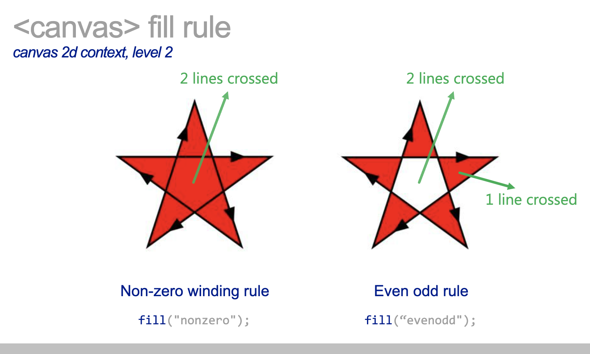

## chart

- 2D 차트 만들기
- Vanilla Javascript로 차트 만들기
- Class에 대한 이해

### Class
https://developer.mozilla.org/ko/docs/Web/JavaScript/Reference/Classes

- es5에서의 prototype에 의한 Class와는 약간 다른 의미를 가집니다.
- 함수 선언과 클래스 선언의 중요한 차이점은 함수 선언의 경우 호이스팅이 일어나지만, 클래스 선언은 그렇지 않다는 것입니다.
- class 표현식의 이름은 클래스 body의 local scope에 한해 유효합니다.

```js
// unnamed
let Rectangle = class {
  constructor(height, width) {
    this.height = height;
    this.width = width;
  }
};
console.log(Rectangle.name);
// 출력: "Rectangle"

// named
let Rectangle = class Rectangle2 {
  constructor(height, width) {
    this.height = height;
    this.width = width;
  }
};
console.log(Rectangle.name);
// 출력: "Rectangle2"

```
### getContext
https://developer.mozilla.org/ko/docs/Web/API/HTMLCanvasElement/getContext
- 메소드는 캔버스의 드로잉 컨텍스트를 반환합니다. 
- 컨텍스트 식별자가 지원되지 않을 경우 null을 반환합니다.
  
### fillStyle
https://developer.mozilla.org/en-US/docs/Web/API/CanvasRenderingContext2D/fillStyle
- 말그대로 스타일을 채울 수 있는 메소드 입니다.
- color, gradient, pattern과 같은 스타일 성질을 적용시킵니다.

### fillRect
https://developer.mozilla.org/en-US/docs/Web/API/CanvasRenderingContext2D/fillRect
- 사각형을 그리는 용도로 사용됩니다.
### arc, stroke, fill
- arc는 원형을 그리는 용도로 사용됩니다.
- stroke는 선을 그을 수 있습니다.
- fill은 그림을 실제로 그립니다.
- 두가지 정도의 룰이 있습니다.
